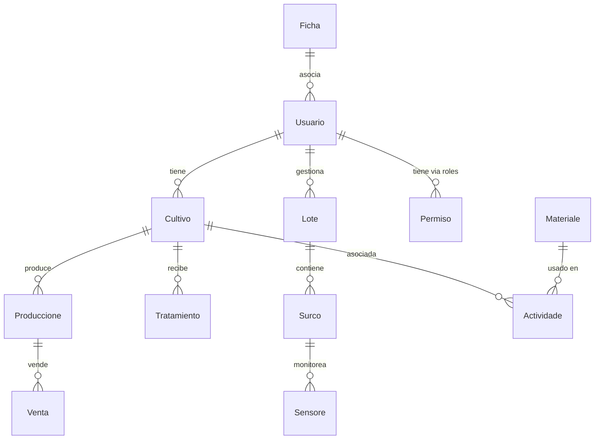

# Arquitectura del Backend

El backend está construido con NestJS, siguiendo una arquitectura modular y limpia. Utiliza TypeORM para la base de datos PostgreSQL, JWT para autenticación, Redis para cache, y MQTT para integración IoT. A continuación, diagramas que ilustran la estructura general, relaciones de entidades y flujos por módulo.

## Diagrama General de Arquitectura

```mermaid
graph TB
    subgraph "Capa de Presentación (HTTP)"
        Controllers[Controladores<br>(Ej: UsuariosController, CultivosController)]
        Guards[JwtAuthGuard<br>(Protege rutas con JWT)]
    end
    
    subgraph "Capa de Servicios (Lógica)"
        Services[Servicios<br>(Ej: UsuariosService, CultivosService)]
        DTOs[DTOs<br>(Validaciones con class-validator)]
    end
    
    subgraph "Capa de Datos"
        Entities[Entidades<br>(Ej: Usuario, Cultivo)]
        TypeORM[TypeORM<br>(ORM para consultas)]
        DB[(Base de Datos<br>PostgreSQL)]
    end
    
    subgraph "Infraestructura y Seguridad"
        Redis[(Redis<br>Cache para sesiones)]
        MQTT[MQTT Config<br>(Para sensores IoT)]
        Auth[JwtStrategy<br>(Autenticación y permisos)]
        Multer[Multer<br>(Subida de archivos)]
    end
    
    Controllers --> Guards
    Guards --> Services
    Services --> DTOs
    Services --> Entities
    Entities --> TypeORM
    TypeORM --> DB
    Services --> Redis
    Services --> MQTT
    Auth --> Guards
    Multer --> Services
```

### Descripción
- **Controladores**: Manejan endpoints REST, protegidos por guards.
- **Servicios**: Contienen lógica de negocio, interactúan con entidades y DTOs.
- **Entidades**: Modelos de DB con decoradores TypeORM.
- **DTOs**: Validan entradas/salidas.
- **Infraestructura**: Cache, IoT, auth y uploads.

## Diagrama ER Simplificado de Entidades



### Descripción
- Relaciones principales: Usuario gestiona lotes/cultivos, lotes contienen surcos con sensores, cultivos producen y se tratan.
- Tipos: 1:N (uno a muchos), opcionales con "o".

## Diagrama Específico del Módulo de Usuarios

```mermaid
graph LR
    Client[Cliente<br>(Frontend)] --> POST_USERS[POST /usuarios<br>(UsuariosController)]
    POST_USERS --> JwtAuthGuard[JwtAuthGuard<br>(Verifica token)]
    JwtAuthGuard --> UsuariosService[UsuariosService<br>(Lógica de negocio)]
    UsuariosService --> CreateUsuarioDto[CreateUsuarioDto<br>(Validaciones)]
    UsuariosService --> UsuarioEntity[Usuario Entity<br>(Modelo DB)]
    UsuarioEntity --> TypeORM[TypeORM] --> DB[(PostgreSQL)]
    UsuariosService --> Redis[(Redis<br>Cache opcional)]
    UsuariosService --> Response[Respuesta<br>(Usuario creado)]
```

### Descripción
- Flujo típico: Request → Guard → Service → DTO/Entity → DB/Redis → Response.
- Similar para otros módulos (cultivos, lotes, etc.), reemplazando entidades/DTOs.

## Diagrama Específico del Módulo de Cultivos

```mermaid
graph LR
    Client --> POST_CULTIVOS[POST /cultivos<br>(CultivosController)]
    POST_CULTIVOS --> JwtAuthGuard
    JwtAuthGuard --> CultivosService[CultivosService]
    CultivosService --> CreateCultivoDto[CreateCultivoDto]
    CultivosService --> CultivoEntity[Cultivo Entity]
    CultivoEntity --> TypeORM --> DB
    CultivosService --> Response
```

## Diagrama Específico del Módulo de Lotes

```mermaid
graph LR
    Client --> POST_LOTES[POST /lotes<br>(LotesController)]
    POST_LOTES --> JwtAuthGuard
    JwtAuthGuard --> LotesService[LotesService]
    LotesService --> CreateLoteDto[CreateLoteDto<br>(Incluye coordenadas)]
    LotesService --> LoteEntity[Lote Entity]
    LoteEntity --> TypeORM --> DB
    LotesService --> Response
```

## Notas sobre la Arquitectura
- **Modularidad**: Cada módulo (actividades, materiales, etc.) sigue el patrón Controller-Service-Entity.
- **Seguridad**: Guards y estrategias JWT protegen rutas; permisos gestionan accesos.
- **IoT**: MQTT integra sensores en surcos para monitoreo en tiempo real.
- **Cache**: Redis acelera consultas frecuentes.
- Para más detalles, ver [DTOs.md](DTOs.md) y [Despliegue.md](Despliegue.md).