# Arquitectura del Backend

El backend está construido con NestJS, siguiendo una arquitectura modular y limpia. Utiliza TypeORM para la base de datos PostgreSQL, JWT para autenticación, Redis para cache, y MQTT para integración IoT. A continuación, diagramas que ilustran la estructura general, relaciones de entidades y flujos por módulo.

## Diagrama General de Arquitectura

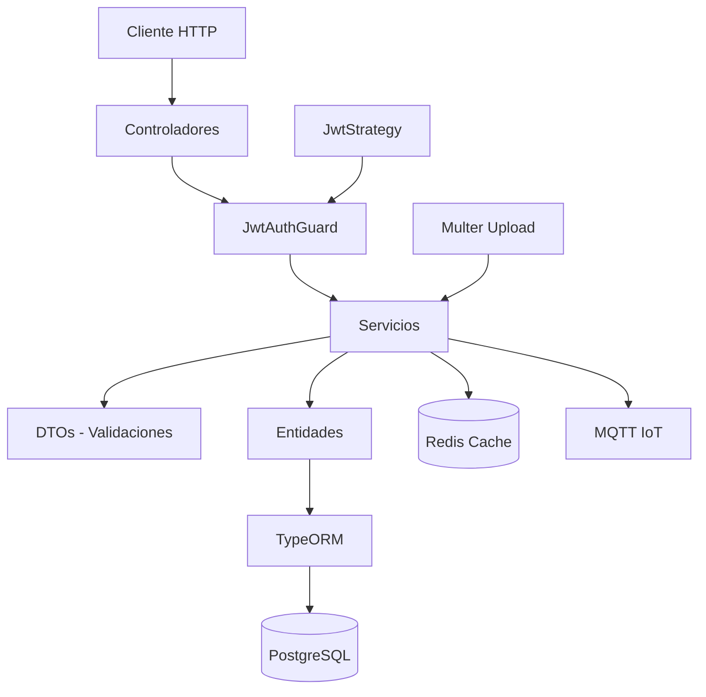

### Descripción
- **Controladores**: Manejan endpoints REST, protegidos por guards.
- **Servicios**: Contienen lógica de negocio, interactúan con entidades y DTOs.
- **Entidades**: Modelos de DB con decoradores TypeORM.
- **DTOs**: Validan entradas/salidas.
- **Infraestructura**: Cache, IoT, auth y uploads.

## Diagrama ER Simplificado de Entidades

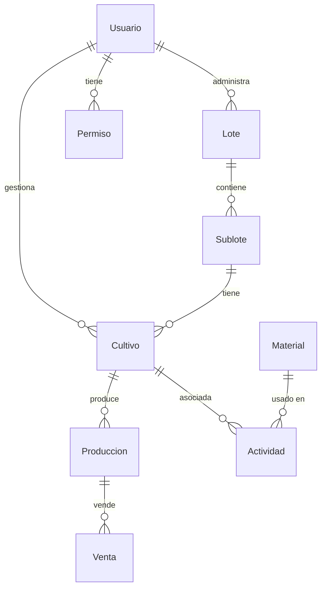

### Descripción
- **Relaciones principales**: Usuario administra lotes y cultivos, lotes contienen sublotes, sublotes tienen cultivos, cultivos producen y generan ventas.
- **Tipos**: 1:N (uno a muchos), opcionales con "o".
- **Ver diagrama completo** más abajo para todas las entidades y relaciones detalladas.

## Diagrama Específico del Módulo de Usuarios

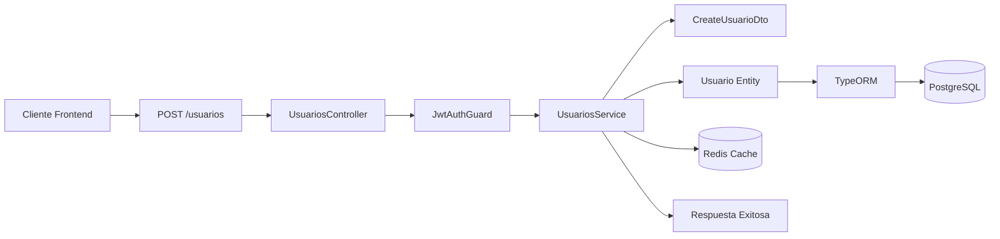

### Descripción
- Flujo típico: Request → Guard → Service → DTO/Entity → DB/Redis → Response.
- Similar para otros módulos (cultivos, lotes, etc.), reemplazando entidades/DTOs.

## Diagrama Específico del Módulo de Cultivos

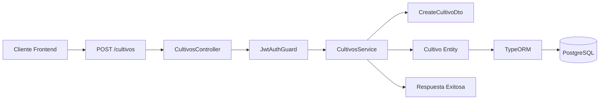

## Diagrama Específico del Módulo de Lotes

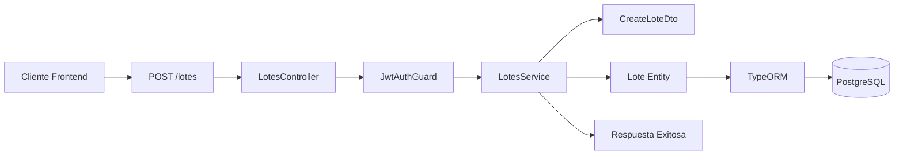

## Estructura Completa de la Base de Datos

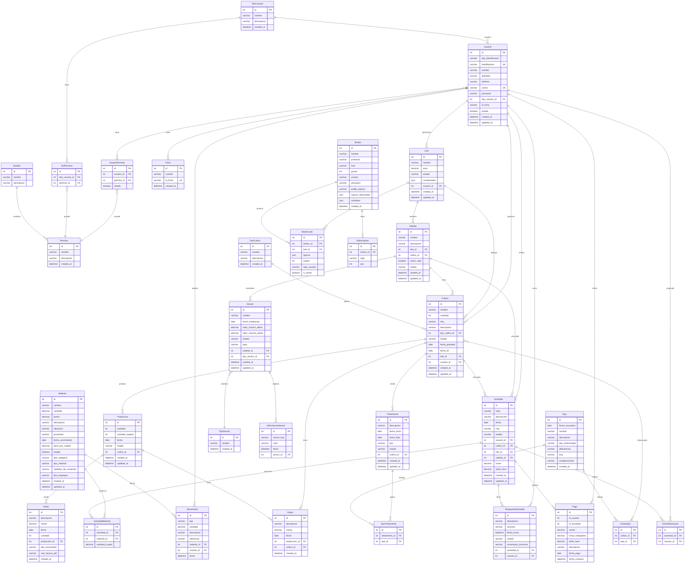

### Descripción de las Tablas y su Contenido

#### **Entidades de Usuarios y Seguridad:**
- **Usuario**: Datos personales, credenciales, rol y ficha académica
- **Ficha**: Información académica (id_ficha, nombre)
- **TipoUsuario**: Roles del sistema (Admin, Agricultor, etc.)
- **Permiso**: Accesos específicos del sistema
- **UsuarioPermiso**: Relación muchos a muchos usuarios-permisos
- **RolPermiso**: Relación muchos a muchos roles-permisos
- **Modulo**: Agrupaciones de permisos del sistema

#### **Entidades Geográficas y Agrícolas:**
- **Lote**: Áreas de terreno con coordenadas geográficas
- **Sublote**: Subdivisiones dentro de lotes para cultivos específicos
- **Cultivo**: Plantaciones con tipo, estado y fechas
- **TipoCultivo**: Catálogo de tipos de cultivos disponibles

#### **Entidades de Producción y Ventas:**
- **Produccion**: Cosechas con cantidades y estados
- **Venta**: Transacciones comerciales con facturación
- **Gasto**: Costos asociados a producciones

#### **Entidades de Inventario y Actividades:**
- **Material**: Insumos con categorías, tipos y empaques
- **Actividad**: Trabajos realizados con materiales usados
- **ActividadMaterial**: Relación consumo de materiales
- **ActividadUsuario**: Asignación de actividades a usuarios
- **RespuestaActividad**: Respuestas y evaluaciones de actividades
- **Pago**: Pagos por actividades realizadas
- **Movimiento**: Registro de movimientos de inventario

#### **Entidades IoT y Monitoreo:**
- **Sensor**: Dispositivos de medición con alertas
- **TipoSensor**: Clasificación de sensores
- **InformacionSensor**: Datos históricos de sensores
- **Broker**: Servidores MQTT para comunicación
- **BrokerLote**: Conexión entre brokers y lotes
- **Subscripcion**: Tópicos MQTT suscritos

#### **Entidades Fitosanitarias:**
- **Epa**: Problemas fitosanitarios detectados
- **Tratamiento**: Soluciones aplicadas
- **CultivoEpa**: Relación cultivos afectados
- **EpaTratamiento**: Tratamientos aplicados a problemas

#### **Relaciones Clave:**
- **Jerarquía**: Usuario → Lote → Sublote → Cultivo → Produccion → Venta
- **Control**: Usuario administra lotes, cultivos y actividades
- **Consumo**: Actividades usan materiales, producciones generan gastos, movimientos rastrean inventario
- **Monitoreo**: Sublotes tienen sensores conectados via MQTT, brokers conectan lotes
- **Salud**: Cultivos pueden tener problemas (Epa) que requieren tratamientos
- **Aprendizaje**: Actividades asignadas a usuarios generan respuestas, pagos y evaluaciones

## Diagrama de Secuencia - Flujo Típico de Operación

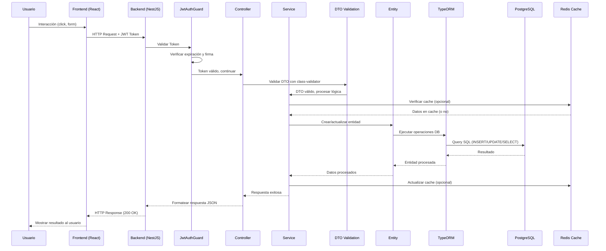

### Descripción del Flujo de Secuencia
1. **Usuario** interactúa con la interfaz
2. **Frontend** envía request HTTP con JWT
3. **JwtAuthGuard** valida el token
4. **Controller** recibe la petición
5. **DTO Validation** valida los datos de entrada
6. **Service** ejecuta la lógica de negocio
7. **Redis Cache** acelera consultas frecuentes
8. **Entity + TypeORM** maneja la persistencia
9. **PostgreSQL** almacena los datos
10. **Respuesta** retorna al usuario

## Diagramas de Casos de Uso - Sistema AgroTech

### Actores del Sistema
- **Administrador**: Control total del sistema, gestión de usuarios y configuración
- **Agricultor**: Gestión operativa de cultivos, lotes, producciones y ventas
- **Aprendiz**: Participación en actividades de aprendizaje y formación
- **Sistema IoT**: Sensores y dispositivos que envían datos automáticamente

---

### Diagrama 1: Gestión de Usuarios y Seguridad

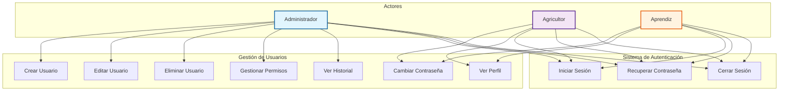

---

### Diagrama 2: Sistema Agrícola y Producción

```mermaid
graph TD
    subgraph "Actores"
        A1[Administrador]
        A2[Agricultor]
    end

    subgraph "Gestión de Terrenos"
        UC1[Crear Lote]
        UC2[Editar Lote]
        UC3[Eliminar Lote]
        UC4[Ver Mapa de Lotes]
        UC5[Crear Surco]
        UC6[Gestionar Surcos]
        UC7[Configurar Coordenadas]
    end

    subgraph "Gestión de Cultivos"
        UC8[Crear Cultivo]
        UC9[Editar Cultivo]
        UC10[Monitorear Cultivo]
        UC11[Cambiar Estado]
        UC12[Asignar Tipos]
    end

    subgraph "Producción y Cosecha"
        UC13[Registrar Producción]
        UC14[Editar Producción]
        UC15[Control de Calidad]
        UC16[Historial de Rendimientos]
    end

    A1 --> UC1
    A1 --> UC2
    A1 --> UC3
    A1 --> UC4
    A1 --> UC5
    A1 --> UC6
    A1 --> UC7
    A1 --> UC8
    A1 --> UC9
    A1 --> UC10
    A1 --> UC11
    A1 --> UC12
    A1 --> UC13
    A1 --> UC14
    A1 --> UC15
    A1 --> UC16

    A2 --> UC1
    A2 --> UC2
    A2 --> UC4
    A2 --> UC5
    A2 --> UC6
    A2 --> UC7
    A2 --> UC8
    A2 --> UC9
    A2 --> UC10
    A2 --> UC11
    A2 --> UC12
    A2 --> UC13
    A2 --> UC14
    A2 --> UC15
    A2 --> UC16

    classDef admin fill:#e1f5fe,stroke:#01579b,stroke-width:2px
    classDef agricultor fill:#f3e5f5,stroke:#4a148c,stroke-width:2px

    class A1 admin
    class A2 agricultor
```

---

### Diagrama 3: Sistema IoT y Monitoreo

```mermaid
graph TD
    subgraph "Actores"
        A1[Administrador]
        A2[Agricultor]
        A3[Sistema IoT]
    end

    subgraph "Configuración IoT"
        UC1[Configurar Broker MQTT]
        UC2[Crear Subscripciones]
        UC3[Gestionar Tópicos]
        UC4[Configurar Conexiones]
    end

    subgraph "Gestión de Sensores"
        UC5[Crear Sensor]
        UC6[Editar Sensor]
        UC7[Eliminar Sensor]
        UC8[Configurar Alertas]
        UC9[Asignar Tipos]
    end

    subgraph "Monitoreo y Alertas"
        UC10[Monitorear Sensores]
        UC11[Recibir Alertas]
        UC12[Ver Datos en Tiempo Real]
        UC13[Ver Datos Históricos]
        UC14[Generar Reportes]
    end

    A1 --> UC1
    A1 --> UC2
    A1 --> UC3
    A1 --> UC4
    A1 --> UC5
    A1 --> UC6
    A1 --> UC7
    A1 --> UC8
    A1 --> UC9
    A1 --> UC10
    A1 --> UC11
    A1 --> UC12
    A1 --> UC13
    A1 --> UC14

    A2 --> UC5
    A2 --> UC6
    A2 --> UC8
    A2 --> UC10
    A2 --> UC11
    A2 --> UC12
    A2 --> UC13
    A2 --> UC14

    A3 --> UC10
    A3 --> UC11
    A3 --> UC12

    classDef admin fill:#e1f5fe,stroke:#01579b,stroke-width:2px
    classDef agricultor fill:#f3e5f5,stroke:#4a148c,stroke-width:2px
    classDef iot fill:#e8f5e8,stroke:#1b5e20,stroke-width:2px

    class A1 admin
    class A2 agricultor
    class A3 iot
```

---

### Diagrama 4: Inventario y Actividades

```mermaid
graph TD
    subgraph "Actores"
        A1[Administrador]
        A2[Agricultor]
        A3[Aprendiz]
    end

    subgraph "Gestión de Inventario"
        UC1[Crear Material]
        UC2[Editar Material]
        UC3[Eliminar Material]
        UC4[Ver Inventario]
        UC5[Control de Stock]
        UC6[Gestionar Categorías]
        UC7[Alertas de Stock]
    end

    subgraph "Sistema de Actividades"
        UC8[Crear Actividad]
        UC9[Asignar Actividad]
        UC10[Editar Actividad]
        UC11[Eliminar Actividad]
        UC12[Ver Historial]
    end

    subgraph "Evaluación y Aprendizaje"
        UC13[Enviar Respuesta]
        UC14[Calificar Respuesta]
        UC15[Ver Evaluaciones]
        UC16[Descargar Evidencia]
        UC17[Seguimiento de Progreso]
    end

    A1 --> UC1
    A1 --> UC2
    A1 --> UC3
    A1 --> UC4
    A1 --> UC5
    A1 --> UC6
    A1 --> UC7
    A1 --> UC8
    A1 --> UC9
    A1 --> UC10
    A1 --> UC11
    A1 --> UC12
    A1 --> UC13
    A1 --> UC14
    A1 --> UC15
    A1 --> UC16
    A1 --> UC17

    A2 --> UC1
    A2 --> UC2
    A2 --> UC4
    A2 --> UC5
    A2 --> UC6
    A2 --> UC7
    A2 --> UC8
    A2 --> UC9
    A2 --> UC10
    A2 --> UC12
    A2 --> UC13
    A2 --> UC15
    A2 --> UC16
    A2 --> UC17

    A3 --> UC13
    A3 --> UC15
    A3 --> UC16
    A3 --> UC17

    classDef admin fill:#e1f5fe,stroke:#01579b,stroke-width:2px
    classDef agricultor fill:#f3e5f5,stroke:#4a148c,stroke-width:2px
    classDef aprendiz fill:#fff3e0,stroke:#e65100,stroke-width:2px

    class A1 admin
    class A2 agricultor
    class A3 aprendiz
```

---

### Diagrama 5: Ventas, Finanzas y Fitosanitario

```mermaid
graph TD
    subgraph "Actores"
        A1[ Administrador]
        A2[ Agricultor]
    end

    subgraph "Sistema Comercial"
        UC1[Registrar Venta]
        UC2[Editar Venta]
        UC3[Eliminar Venta]
        UC4[Generar Factura]
        UC5[Ver Historial de Ventas]
        UC6[Control de Inventario]
    end

    subgraph "Gestión Financiera"
        UC7[Ver Reportes Financieros]
        UC8[Control de Gastos]
        UC9[Análisis de Costos]
        UC10[Presupuestos]
        UC11[Alertas Financieras]
    end

    subgraph "Salud de Cultivos"
        UC12[Diagnosticar EPA]
        UC13[Crear Tratamiento]
        UC14[Editar Tratamiento]
        UC15[Monitorear Tratamientos]
        UC16[Historial Fitosanitario]
        UC17[Alertas Sanitarias]
    end

    A1 --> UC1
    A1 --> UC2
    A1 --> UC3
    A1 --> UC4
    A1 --> UC5
    A1 --> UC6
    A1 --> UC7
    A1 --> UC8
    A1 --> UC9
    A1 --> UC10
    A1 --> UC11
    A1 --> UC12
    A1 --> UC13
    A1 --> UC14
    A1 --> UC15
    A1 --> UC16
    A1 --> UC17

    A2 --> UC1
    A2 --> UC2
    A2 --> UC4
    A2 --> UC5
    A2 --> UC6
    A2 --> UC7
    A2 --> UC8
    A2 --> UC9
    A2 --> UC10
    A2 --> UC11
    A2 --> UC12
    A2 --> UC13
    A2 --> UC14
    A2 --> UC15
    A2 --> UC16
    A2 --> UC17

    classDef admin fill:#e1f5fe,stroke:#01579b,stroke-width:2px
    classDef agricultor fill:#f3e5f5,stroke:#4a148c,stroke-width:2px

    class A1 admin
    class A2 agricultor
```

## Diagrama ER Detallado - Todas las Entidades

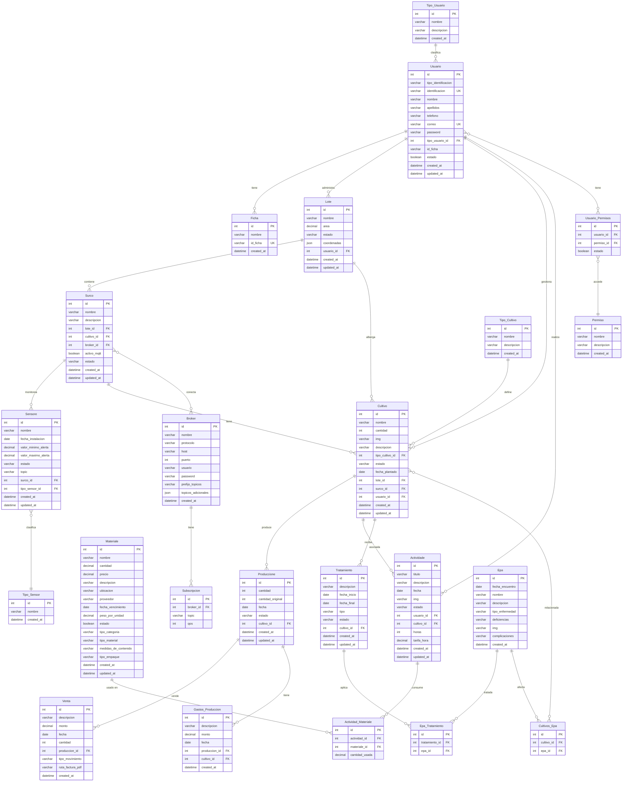

### Descripción Completa del Diagrama ER

#### **Entidades y Atributos Principales:**

**Usuarios y Seguridad:**
- `Usuario`: Información personal, credenciales, rol
- `TipoUsuario`: Roles (Admin, Agricultor, Instructor, Aprendiz)
- `Permiso`: Accesos específicos del sistema
- `UsuarioPermiso`: Relación muchos-muchos usuarios-permisos
- `RolPermiso`: Relación muchos-muchos roles-permisos
- `Modulo`: Agrupaciones de permisos
- `Ficha`: Información académica

**Geografía Agrícola:**
- `Lote`: Áreas de terreno con coordenadas GPS
- `Sublote`: Subdivisiones dentro de lotes
- `Cultivo`: Plantaciones específicas
- `TipoCultivo`: Catálogo de tipos de cultivos

**Producción y Ventas:**
- `Produccion`: Cosechas y rendimientos
- `Venta`: Transacciones comerciales
- `Gasto`: Costos asociados

**Inventario:**
- `Material`: Insumos agrícolas con categorías
- `Movimiento`: Registro de entradas y salidas de inventario

**Actividades:**
- `Actividad`: Trabajos realizados
- `ActividadMaterial`: Consumo de materiales
- `ActividadUsuario`: Asignación de actividades
- `RespuestaActividad`: Respuestas de usuarios
- `Pago`: Pagos por actividades

**IoT:**
- `Sensor`: Dispositivos de medición
- `TipoSensor`: Clasificación de sensores
- `InformacionSensor`: Datos históricos
- `Broker`: Servidores MQTT
- `BrokerLote`: Conexiones broker-lote
- `Subscripcion`: Tópicos suscritos

**Fitosanitario:**
- `Tratamiento`: Soluciones aplicadas
- `Epa`: Problemas detectados
- `CultivoEpa`: Relaciones cultivo-problema
- `EpaTratamiento`: Tratamientos aplicados

#### **Relaciones Clave:**
- **Jerarquía Espacial**: Usuario → Lote → Sublote → Cultivo
- **Ciclo Productivo**: Cultivo → Produccion → Venta
- **Control de Acceso**: Usuario → TipoUsuario → RolPermiso → Permiso
- **Monitoreo**: Sublote → Sensor → InformacionSensor, Lote → BrokerLote → Broker
- **Salud**: Cultivo → CultivoEpa → Epa → EpaTratamiento → Tratamiento
- **Consumo**: Actividad → ActividadMaterial → Material, Movimiento registra cambios
- **Aprendizaje**: Actividad → ActividadUsuario → RespuestaActividad → Pago

## Notas sobre la Arquitectura
- **Modularidad**: Cada módulo (actividades, materiales, etc.) sigue el patrón Controller-Service-Entity.
- **Seguridad**: Guards y estrategias JWT protegen rutas; permisos gestionan accesos.
- **IoT**: MQTT integra sensores en surcos para monitoreo en tiempo real.
- **Cache**: Redis acelera consultas frecuentes.
- Para más detalles, ver [DTOs y Validaciones](/dtos) y [Despliegue](/despliegue).