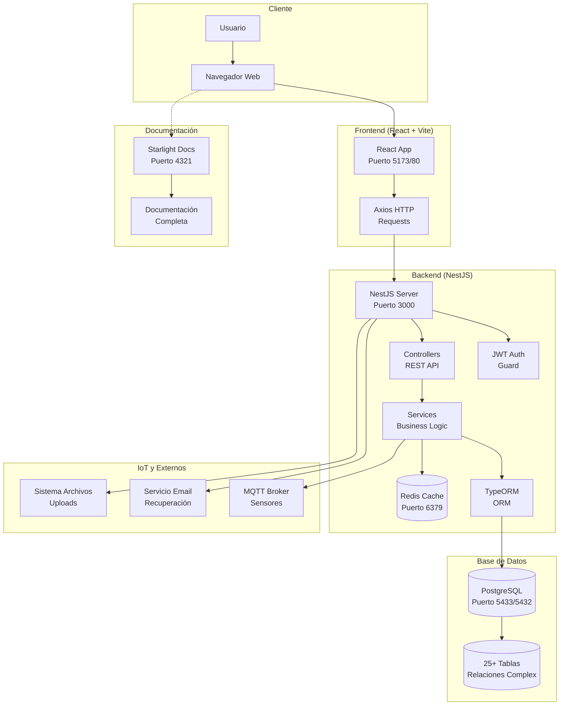

# Despliegue del Proyecto AgroTech

## Arquitectura General del Sistema

El proyecto **AgroTech** es una aplicación web completa que consta de tres componentes principales:

- **📊 Frontend**: Interfaz de usuario desarrollada con React + Vite
- **🔧 Backend**: API REST desarrollada con NestJS + TypeORM
- **🗄️ Base de Datos**: PostgreSQL con Redis para cache

## Requisitos del Sistema

### Requisitos Mínimos:
- **Node.js** 18+ y npm
- **Docker** y Docker Compose
- **Git** para control de versiones
- **4GB RAM** mínimo
- **10GB espacio en disco**

### Puertos Requeridos:
- **3000**: Backend (NestJS)
- **5173**: Frontend (Vite dev server)
- **5433**: PostgreSQL (mapeado desde 5432)
- **6379**: Redis
- **4321**: Documentación (Starlight)

## 🚀 Despliegue Completo del Sistema

### Paso 1: Clonar el Repositorio
```bash
git clone https://github.com/KERLINFIGUEROA0/ProyectoFormativoAgrotech.git
cd ProyectoFormativoAgrotech
```

### Paso 2: Configurar y Ejecutar Backend

#### Variables de Entorno del Backend
Crear archivo `backend/.env`:
```env
# Base de Datos
DB_HOST=localhost
DB_PORT=5433
DB_USERNAME=myuser
DB_PASSWORD=mypassword
DB_NAME=bdproyectoformativo

# Autenticación
JWT_SECRET=tu_secreto_jwt_muy_seguro_aqui

# Cache
REDIS_URL=redis://localhost:6379

# Servidor
PORT=3000
NODE_ENV=development
```

#### Ejecutar Backend con Docker
```bash
# Navegar al directorio backend
cd backend

# Levantar servicios de base de datos
docker-compose up -d

# Ejecutar seed para crear usuario administrador
npm run seed

# Iniciar servidor de desarrollo
npm run start:dev
```

**Verificación**: `http://localhost:3000` debería mostrar la API funcionando.

### Paso 3: Configurar y Ejecutar Frontend

#### Variables de Entorno del Frontend
Crear archivo `frontend/.env`:
```env
# URLs del sistema
VITE_BACKEND_URL=http://localhost:3000
VITE_FRONTEND_URL=http://localhost:5173

# Google Maps (requerido para mapas)
VITE_GOOGLE_MAPS_API_KEY=tu_clave_api_google_maps
```

#### Ejecutar Frontend
```bash
# Navegar al directorio frontend
cd frontend

# Instalar dependencias
npm install

# Iniciar servidor de desarrollo
npm run dev
```

**Verificación**: `http://localhost:5173` debería mostrar la aplicación web.

### Paso 4: Ejecutar Documentación (Opcional)
```bash
# Navegar al directorio de documentación
cd documentacion

# Instalar dependencias
npm install

# Iniciar servidor de documentación
npm run dev
```

**Verificación**: `http://localhost:4321` debería mostrar la documentación completa.


  # Cache
  redis:
    image: redis:alpine
    volumes:
      - redis_prod_data:/data
    ports:
      - "6379:6379"

  # Backend
  backend:
    image: agrotech-backend:latest
    environment:
      - DB_HOST=postgres
      - DB_PORT=5432
      - DB_USERNAME=prod_user
      - DB_PASSWORD=prod_password
      - DB_NAME=agrotech_prod
      - JWT_SECRET=tu_jwt_secret_prod
      - REDIS_URL=redis://redis:6379
      - NODE_ENV=production
    ports:
      - "3000:3000"
    depends_on:
      - postgres
      - redis

  # Frontend
  frontend:
    image: agrotech-frontend:latest
    environment:
      - VITE_BACKEND_URL=http://backend:3000
      - VITE_FRONTEND_URL=http://localhost:80
    ports:
      - "80:80"
    depends_on:
      - backend

volumes:
  postgres_prod_data:
  redis_prod_data:
```

### Ejecutar Producción
```bash
docker-compose -f docker-compose.prod.yml up -d
```

## 📊 Diagrama de Despliegue Completo



### Descripción de Componentes

#### **Frontend (React + Vite)**
- **Framework**: React 19 con TypeScript
- **Build Tool**: Vite para desarrollo rápido
- **UI Libraries**: HeroUI, Material-UI, TailwindCSS
- **Maps**: Leaflet + Google Maps integration
- **Charts**: Recharts para visualización de datos
- **State**: React Router para navegación
- **HTTP**: Axios para comunicación con backend
- **Real-time**: Socket.io y MQTT para actualizaciones en vivo

#### **Backend (NestJS)**
- **Framework**: NestJS con TypeScript
- **ORM**: TypeORM para PostgreSQL
- **Auth**: JWT con guards y estrategias
- **Cache**: Redis para optimización
- **IoT**: Integración MQTT para sensores
- **Files**: Multer para uploads de imágenes
- **Email**: Servicio de correos para recuperación de contraseña
- **Validation**: Class-validator para DTOs

#### **Base de Datos (PostgreSQL)**
- **Motor**: PostgreSQL 15
- **Tablas**: 25+ entidades relacionadas
- **Relaciones**: Complejas (1:N, N:M)
- **Índices**: Optimizados para consultas
- **Triggers**: Automatización de procesos

#### **Cache (Redis)**
- **Uso**: Cache de sesiones y datos frecuentes
- **Persistencia**: Configurado para desarrollo/producción
- **TTL**: Time-to-live para expiración automática

## 🔧 Comandos Útiles de Desarrollo

### Backend
```bash
cd backend
npm run start:dev          # Desarrollo con hot reload
npm run build             # Build de producción
npm run seed              # Poblar base de datos
```

### Frontend
```bash
cd frontend
npm run dev               # Servidor de desarrollo
npm run build             # Build optimizado
npm run preview           # Vista previa de producción
npm run lint              # Verificar código
```

### Docker
```bash
# Desarrollo
docker-compose up -d       # Levantar DB y Redis
docker-compose down        # Detener servicios

## 🚨 Solución de Problemas

### Puerto ya en uso
```bash
# Ver qué proceso usa el puerto
netstat -ano | findstr :3000

# Matar proceso específico
taskkill /PID <PID> /F

# O cambiar puerto en configuración
```

### Error de conexión a base de datos
```bash
# Verificar contenedores Docker
docker ps

# Ver logs de PostgreSQL
docker logs postgres_container

# Reiniciar servicios
docker-compose down && docker-compose up -d
```

### Frontend no carga
```bash
# Limpiar cache de node_modules
rm -rf node_modules package-lock.json
npm install

# Verificar variables de entorno
cat .env
```

## 📈 Monitoreo y Logs

### Ver logs en tiempo real
```bash
# Backend
cd backend && npm run start:dev

# Frontend
cd frontend && npm run dev

# Docker services
docker-compose logs -f
```

### Health checks
- **Backend**: `GET http://localhost:3000/health`
- **Frontend**: Verificar carga inicial en navegador
- **Database**: Verificar conexión en logs del backend

## 🔒 Configuración de Seguridad

### Variables Sensibles
- `JWT_SECRET`: Cambiar en producción
- `DB_PASSWORD`: Usar contraseñas fuertes
- `GOOGLE_MAPS_API_KEY`: Restringir por dominio

### HTTPS en Producción
- Configurar SSL/TLS certificates
- Usar variables de entorno seguras
- Implementar rate limiting

## 📝 Checklist de Despliegue

- [ ] Repositorio clonado
- [ ] Variables de entorno configuradas
- [ ] Docker services ejecutándose
- [ ] Base de datos poblada (seed)
- [ ] Backend responding en puerto 3000
- [ ] Frontend cargando en puerto 5173
- [ ] Documentación disponible en puerto 4321
- [ ] Funcionalidades principales probadas
- [ ] Usuario administrador creado

## 🎯 Próximos Pasos

1. **Configurar dominio y SSL**
2. **Implementar CI/CD pipeline**
3. **Configurar monitoring (PM2, Grafana)**
4. **Backup automático de base de datos**
5. **Configurar logs centralizados**