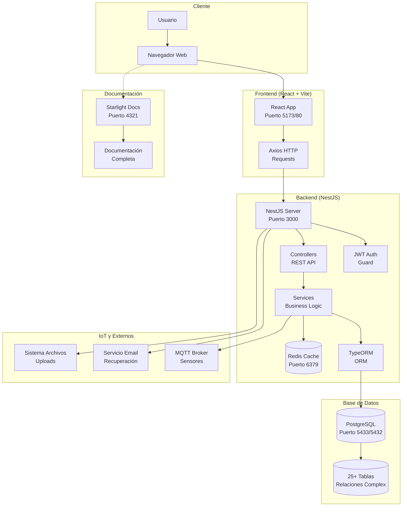

# Despliegue del Proyecto AgroTech

## Arquitectura General del Sistema

El proyecto **AgroTech** es una aplicación web completa que consta de tres componentes principales:

- **Frontend**: Interfaz de usuario desarrollada con React + Vite
- **Backend**: API REST desarrollada con NestJS + TypeORM
- **Base de Datos**: PostgreSQL con Redis para cache

## Requisitos del Sistema

### Requisitos Mínimos:
- **Node.js** v22.20.0 y npm
- **Docker** y Docker Compose
- **Git** para control de versiones
- **4GB RAM** mínimo
- **10GB espacio en disco**

### Puertos Requeridos:
- **3000**: Backend (NestJS)
- **5173**: Frontend (Vite dev server)
- **5433**: PostgreSQL (mapeado desde 5432)
- **6379**: Redis
- **4321**: Documentación (Starlight)
## Configuración de Docker para Backend

### Dockerfile Multi-Stage Build

El backend utiliza un Dockerfile multi-stage para optimizar el tamaño de la imagen final y mejorar la seguridad:

```dockerfile
# --- Etapa de Build ---
FROM node:20-alpine AS builder

WORKDIR /usr/src/app

COPY package*.json ./
RUN npm install

COPY . .

RUN npx tsc --build tsconfig.build.json --force

# --- Etapa de Producción ---
FROM node:20-alpine

RUN apk add --no-cache tzdata

WORKDIR /usr/src/app

ENV PUPPETEER_SKIP_DOWNLOAD=true

COPY package*.json ./
RUN npm install --only=production

COPY --from=builder /usr/src/app/dist ./dist

EXPOSE 3000

CMD ["node", "dist/src/main.js"]
```

**Características principales:**
- **Builder stage**: Utiliza Node.js 20 Alpine para instalar dependencias y compilar el proyecto con `npm install` y `npm run build`
- **Production stage**: Utiliza Node.js 20 Alpine optimizada para ejecutar la aplicación con `npm run start:prod`
- **PUPPETEER_SKIP_DOWNLOAD=true**: Configuración para evitar descargar Chromium de Puppeteer en producción
- **Multi-stage**: Reduce el tamaño final de la imagen al no incluir dependencias de desarrollo

##  Despliegue Completo del Sistema

### Paso 1: Clonar el Repositorio
```bash
git clone https://github.com/KERLINFIGUEROA0/ProyectoFormativoAgrotech.git
cd ProyectoFormativoAgrotech
```

### Paso 2: Configurar y Ejecutar Backend

#### Variables de Entorno del Backend
Crear archivo `backend/.env`:
```env
# Base de Datos
DB_HOST=localhost
DB_PORT=5433
DB_USER=myuser
DB_PASSWORD=mypassword
DB_NAME=bdproyectoformativo

# Autenticación
JWT_SECRET=tu_secreto_jwt_muy_seguro_aqui

# Cache
REDIS_URL=redis://localhost:6379

# Servidor
PORT=3000
NODE_ENV=development

# Usuario Administrador (para seed)
ADMIN_TIPO_IDENTIFICACION=CC
ADMIN_IDENTIFICACION=1000000000
ADMIN_NOMBRE=Administrador
ADMIN_APELLIDOS=Del Sistema
ADMIN_EMAIL=admin@admin.com
ADMIN_TELEFONO=0000000000
ADMIN_PASSWORD=@dmin123

# Configuración de Correo
MAIL_HOST=smtp.gmail.com
MAIL_PORT=587
MAIL_USER=tu_correo@gmail.com
MAIL_PASS=tu_password_app

# URL del Frontend
FRONTEND_URL=http://localhost:5173
```

#### Ejecutar Backend con Docker
```bash
# Navegar al directorio backend
cd backend

# Levantar servicios de base de datos
docker-compose up -d

# Ejecutar seed para crear usuario administrador
npm run seed

# Iniciar servidor de desarrollo
npm run start:dev
```

**Verificación**: `http://localhost:3000` debería mostrar la API funcionando.

### Paso 3: Configurar y Ejecutar Frontend

#### Variables de Entorno del Frontend
Crear archivo `frontend/.env`:
```env
# URLs del sistema
VITE_BACKEND_URL=http://localhost:3000
VITE_FRONTEND_URL=http://localhost:5173

# Google Maps (requerido para mapas)
VITE_GOOGLE_MAPS_API_KEY=tu_clave_api_google_maps
```

#### Ejecutar Frontend
```bash
# Navegar al directorio frontend
cd frontend

# Instalar dependencias
npm install

# Iniciar servidor de desarrollo
npm run dev
```

**Verificación**: `http://localhost:5173` debería mostrar la aplicación web.

### Paso 4: Ejecutar Documentación (Opcional)
```bash
# Navegar al directorio de documentación
cd documentacion

# Instalar dependencias
npm install

# Iniciar servidor de documentación
npm run dev
```

**Verificación**: `http://localhost:4321` debería mostrar la documentación completa.


```yaml
services:
  db:
    image: postgres:15
    environment:
      POSTGRES_USER: prod_user
      POSTGRES_PASSWORD: prod_password
      POSTGRES_DB: agrotech_prod
      TZ: "America/Bogota"
      PGTZ: "America/Bogota"
    volumes:
      - postgres_data:/var/lib/postgresql/data
    ports:
      - "5432:5432"

  backend:
    image: agrotech-backend:latest
    environment:
      - DB_HOST=db
      - DB_PORT=5432
      - DB_USER=prod_user
      - DB_PASSWORD=prod_password
      - DB_NAME=agrotech_prod
      - JWT_SECRET=tu_jwt_secret_prod
      - REDIS_URL=redis://redis:6379
      - NODE_ENV=production
      - TZ=America/Bogota
      - MAIL_HOST=smtp.gmail.com
      - MAIL_PORT=587
      - MAIL_USER=tu_correo@gmail.com
      - MAIL_PASS=tu_password_app
      - FRONTEND_URL=https://tu-dominio.com
    ports:
      - "3000:3000"
    depends_on:
      - db
      - redis

  redis:
    image: redis:alpine
    volumes:
      - redis_data:/data
    ports:
      - "6379:6379"

  documentacion:
    image: agrotech-documentacion:latest
    ports:
      - "4321:4321"
    environment:
      - TZ=America/Bogota

volumes:
  postgres_data:
  redis_data:
```
```

### Ejecutar Producción
```bash
docker-compose -f docker-compose.prod.yml up -d
```

##  Diagrama de Despliegue Completo



### Descripción de Componentes

#### **Frontend (React + Vite)**
- **Framework**: React 19 con TypeScript
- **Build Tool**: Vite para desarrollo rápido
- **UI Libraries**: HeroUI, Material-UI, TailwindCSS
- **Maps**: Leaflet + Google Maps integration
- **Charts**: Recharts para visualización de datos
- **State**: React Router para navegación
- **HTTP**: Axios para comunicación con backend
- **Real-time**: Socket.io y MQTT para actualizaciones en vivo

#### **Backend (NestJS)**
- **Framework**: NestJS con TypeScript
- **ORM**: TypeORM para PostgreSQL
- **Auth**: JWT con guards y estrategias
- **Cache**: Redis para optimización
- **IoT**: Integración MQTT para sensores
- **Files**: Multer para uploads de imágenes
- **Email**: Servicio de correos para recuperación de contraseña
- **Validation**: Class-validator para DTOs

#### **Base de Datos (PostgreSQL)**
- **Motor**: PostgreSQL 15
- **Tablas**: 25+ entidades relacionadas
- **Relaciones**: Complejas (1:N, N:M)
- **Índices**: Optimizados para consultas
- **Triggers**: Automatización de procesos

#### **Cache (Redis)**
- **Uso**: Cache de sesiones y datos frecuentes
- **Persistencia**: Configurado para desarrollo/producción
- **TTL**: Time-to-live para expiración automática

##  Comandos Útiles de Desarrollo

### Backend
```bash
cd backend
npm run build              # Compilar TypeScript a JavaScript (nest build)
npm run start              # Iniciar servidor en modo producción (nest start)
npm run start:dev          # Desarrollo con hot reload (nest start --watch)
npm run start:debug        # Desarrollo con debugger (nest start --debug --watch)
npm run start:prod         # Ejecutar desde dist/ (node dist/main)
npm run test               # Ejecutar tests con Jest
npm run test:watch         # Tests en modo watch
npm run test:cov           # Tests con cobertura
npm run test:e2e           # Tests end-to-end
npm run lint               # Verificar y corregir código con ESLint
npm run format             # Formatear código con Prettier
npm run typeorm            # CLI de TypeORM para migraciones y entidades
npm run migration:generate # Generar nueva migración
npm run migration:run      # Ejecutar migraciones pendientes
npm run migration:revert   # Revertir última migración
npm run seed               # Poblar base de datos con datos iniciales
```

### Frontend
```bash
cd frontend
npm run dev               # Servidor de desarrollo
npm run build             # Build optimizado
npm run preview           # Vista previa de producción
npm run lint              # Verificar código
```

### Docker
```bash
# Desarrollo
docker-compose up -d       # Levantar DB y Redis
docker-compose down        # Detener servicios

##  Solución de Problemas

### Puerto ya en uso
```bash
# Ver qué proceso usa el puerto
netstat -ano | findstr :3000

# Matar proceso específico
taskkill /PID <PID> /F

# O cambiar puerto en configuración
```

### Error de conexión a base de datos
```bash
# Verificar contenedores Docker
docker ps

# Ver logs de PostgreSQL
docker logs postgres_container

# Reiniciar servicios
docker-compose down && docker-compose up -d
```

### Frontend no carga
```bash
# Limpiar cache de node_modules
rm -rf node_modules package-lock.json
npm install

# Verificar variables de entorno
cat .env
```

##  Monitoreo y Logs

### Ver logs en tiempo real
```bash
# Backend
cd backend && npm run start:dev

# Frontend
cd frontend && npm run dev

# Docker services
docker-compose logs -f
```

### Health checks
- **Backend**: `GET http://localhost:3000/health`
- **Frontend**: Verificar carga inicial en navegador
- **Database**: Verificar conexión en logs del backend
